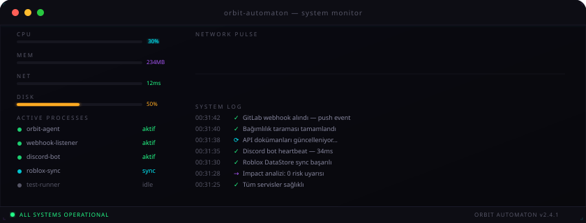

<!-- ═══════════════════════════════════════════════════════════════ -->
<!--        ORBIT AUTOMATON — DARK ZENITH & SUBSTRATE ARCHIVE       -->
<!-- ═══════════════════════════════════════════════════════════════ -->

<div align="center">
  
</div>

<div align="center">
  <a href="https://git.io/typing-svg">
    
  </a>
</div>

<br/>

<div align="center">

[](https://kaptanbey0.github.io/orbit-automaton/)
&nbsp;
[](https://github.com/kaptanbey0/orbit-automaton)
&nbsp;
[](./LICENSE)
&nbsp;
[](https://kaptanbey0.github.io/orbit-automaton/)

</div>

<br/>

<!-- ANIMATED PROFILE CARD -->
<div align="center">
  
</div>

<br/>


---

## 🌑 Overview

**Orbit Automaton** is an ultra-futuristic, dual-layered sci-fi control dashboard and anomaly archive engine. Built with vanilla modern HTML5, CSS3, JavaScript (ES6+), WebGL, and Three.js, it bridges high-performance developer automation with an immersive narrative ecosystem (*SUBSTRATE*).

### 🌌 Dual-Layer Architecture:
1. **Dark Zenith Core**: Real-time developer metrics, GitHub repository sync, live system event ticker, audio synthesis, and interactive sci-fi terminal interface.
2. **SUBSTRATE Anomaly Layer**: Classified anomaly archive containing recovered fragments, interactive 3D WebGL phenomena, mathematical impossibilia, and encrypted researcher logs.

---

## ⚡ Core Features

- 🛸 **Interactive Orbit Core HUD**: Dynamic real-time metrics, system uptime counters, active webhook monitoring, and 30-day commit telemetry graph.
- 💻 **Retro Sci-Fi Terminal**: Fully functional command-line interface supporting custom commands (`access`, `scan`, `status`, `repos`, `ping`, `whoami`, `date`, `cat fragment-00`, `clear`).
- 🌐 **7-Language i18n Engine**: Seamless live multi-language switching across all pages and UI elements (**TR, EN, DE, FR, ES, RU, JA**) without page reloads.
- 🎨 **3D WebGL Anomaly Catalog**: Interactive Three.js canvas renderings for spatial phenomena, impossible geometry, non-Euclidean objects, and morphogenesis.
- 📡 **Live Event Log Feed**: Real-time background observer log ticker with sound synthesis feedback.
- 🎹 **Web Audio API Sound Synth**: Native synthesized UI sound effects, ambient audio toggle, and boot loader chimes without external audio files.
- 📱 **Ultra-Responsive Dark Zenith Design**: Glassmorphism HUD, custom neon scrollbars, keyboard navigation shortcuts (`Ctrl+K` for Database, `/` for Terminal, `Esc` to close modals).

---

## 🗺️ Interactive System Map & Directory

| Node / Page | Description | Security Level | Path |
| :--- | :--- | :---: | :--- |
| **Control Center** | Main Dark Zenith Dashboard & Terminal | `PUBLIC` | [`index.html`](./index.html) |
| **Substrate Archive** | Anomaly Fragment Index Table | `LEVEL 3` | [`archive.html`](./archive.html) |
| **Researchers Database** | Personnel Logbook (A-07, EM, IX, Ω) | `RESTRICTED` | [`researchers.html`](./researchers.html) |
| **Phenomena 3D** | Interactive 3D Spatial Anomaly Catalog | `ACTIVE` | [`phenomena.html`](./phenomena.html) |
| **Impossible Vault** | Non-Euclidean Objects Simulation | `CONTAINED` | [`impossibilia.html`](./impossibilia.html) |
| **GitHub 3D Node** | Interactive 3D External Node Graph | `CONNECTED` | [`github-universe.html`](./github-universe.html) |
| **Containment Logs** | Chronological Sealed Breach Records | `SEALED` | [`containment-log.html`](./containment-log.html) |
| **Morphogenesis** | Evolving Pattern Synthesizer | `EVOLVING` | [`morphogenesis.html`](./morphogenesis.html) |
| **Anti-Gravity** | Gravitational Anomaly Field | `UNSTABLE` | [`antigravity.html`](./antigravity.html) |
| **Fragment 00** | Secret Classified Origin Point | `CLASSIFIED (LEVEL 5)` | [`fragment-00.html`](./fragment-00.html) |

---

## 🛠️ Technology Stack

<div align="center">

#### 🧠 Core Technologies


#### 🤖 Automation & APIs


</div>

---

## 💻 Terminal Command Reference

Launch the built-in terminal on the main dashboard or press `/` to focus input instantly:

```bash
> help              # List all available Orbit Terminal commands
> status            # Display real-time core system diagnostics & uptime
> access <id>       # Access database fragment (e.g. access 00, access archive)
> cat fragment-00   # Read classified origin log file
> repos             # Fetch & list live GitHub repositories
> scan              # Execute full substrate anomaly frequency scan
> ping              # Check core response latency
> date              # Display current system temporal coordinates
> whoami            # Print active Observer ID & security clearance level
> clear             # Clear the terminal output console
```

---

## 📊 Live Metrics & Telemetry

<div align="center">
  
</div>

<br/>

<div align="center">
  
</div>

<br/>

<div align="center">
  
</div>

---

## 🚀 Local Installation & Deployment

No dependencies or build tools required. Orbit Automaton is built with pure web technologies and ready for immediate deployment on GitHub Pages or static hostings.

### Clone Repository:
```bash
git clone https://github.com/kaptanbey0/orbit-automaton.git
cd orbit-automaton
```

### Run Locally:
Simply open `index.html` in any web browser, or launch a quick local server:
```bash
# Python 3
python -m http.server 8000

# Node.js npx
npx serve .
```
Navigate to `http://localhost:8000`.

---

## 🛡️ Lore & Storyline Summary

> *"The substrate was not created. It was remembered."*

In the early cycles of **Orbit Core**, Researcher **A-07** discovered recursive frequency echoes leaking from Node 7.2. As the team (A-07, EM, IX, Ω) investigated the anomalies, observation itself triggered temporal instability—causing Fragment 14 to collapse and entangling Researcher A-07 in temporal loops. Today, KaptanBey0 Automaton acts as the observer barrier, monitoring Substrate anomalies while maintaining operational control.

---


<div align="center">

### 🌑 Dark Zenith Engine

<sub><b>KaptanBey0 Automaton</b> &copy; 2026 &middot; Built with passion, precision, and sci-fi aesthetic.</sub>

<br/><br/>

[](https://github.com/kaptanbey0/orbit-automaton)
[](https://github.com/kaptanbey0/orbit-automaton)

</div>
